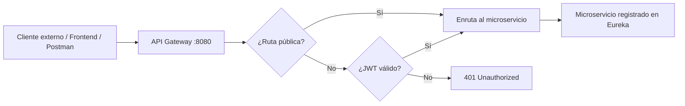

# 🔀 API Gateway - Ecosistema de Microservicios

Este proyecto actúa como el **punto de entrada único**, también conocido como **perímetro de red**, de nuestra arquitectura distribuida.

Utiliza **Spring Cloud Gateway** y opera de forma reactiva sobre **Netty** para enrutar el tráfico externo hacia los microservicios internos registrados en el servidor de descubrimiento **Eureka**. Además, centraliza la validación de seguridad mediante **OAuth 2.1**.

---

## 🏗️ Arquitectura de Red

El **API Gateway** escucha en el puerto estándar:

```bash
8080
```

Toda petición externa proveniente de:

- Frontend
- Postman
- Aplicaciones móviles
- Clientes externos

debe apuntar a este puerto.

El Gateway se encarga de:

1. Interceptar la cabecera HTTP:

```http
Authorization: Bearer <JWT>
```

2. Validar la firma criptográfica del token con el servicio de autenticación.

3. Enrutar dinámicamente la petición al microservicio correspondiente usando balanceo de carga mediante Eureka.

---

## 🛠️ Tecnologías y Versiones Base

| Tecnología | Versión |
|---|---|
| Java | 21 |
| Spring Boot | 3.3.5 |
| Spring Cloud | 2023.0.3 |
| Manejador de dependencias | Gradle Kotlin |
| Gateway | Spring Cloud Gateway |
| Servidor reactivo | Netty |
| Service Discovery | Eureka |
| Seguridad | OAuth 2.1 / JWT |

---

## 🐳 Infraestructura Local: Docker Compose y Base de Datos

El ecosistema utiliza **PostgreSQL** como base de datos relacional para el almacenamiento de usuarios y negocio.

> ⚠️ **Nota importante:** Se ha removido el soporte y la dependencia de **Redis**, por lo que ya no es necesario levantar ningún contenedor de caché ni configurar data sources adicionales para este fin.

Para levantar la base de datos local preconfigurada, sitúate en la raíz del proyecto donde se encuentre el archivo:

```bash
docker-compose.yml
```

Luego ejecuta:

```bash
docker compose up -d
```

Este comando levantará los contenedores definidos en el archivo `docker-compose.yml` en segundo plano.

### Verificar contenedores activos

Puedes validar que la base de datos se haya levantado correctamente con:

```bash
docker compose ps
```

### Detener la infraestructura local

Para apagar los contenedores sin eliminar volúmenes ni datos persistidos:

```bash
docker compose down
```

### Consideraciones

- PostgreSQL debe estar activo antes de iniciar los microservicios que dependan de base de datos.
- Ya no debe configurarse Redis en variables de entorno ni archivos `application.yml`.
- Si el servicio no conecta a la base de datos, valida primero que el contenedor esté levantado y que el puerto configurado coincida con el datasource del microservicio.

---

## ⚙️ Configuración del Enrutamiento

El archivo `application.yml` mapea los paths públicos a los IDs lógicos registrados en Eureka.

```yaml
server:
  port: 8080

spring:
  application:
    name: api-gateway

  cloud:
    gateway:
      discovery:
        locator:
          enabled: true

      routes:
        # Enrutamiento hacia el módulo de Usuarios y Autenticación
        - id: ms-user-auth-register-routes
          uri: lb://MS-USER-AUTH-REGISTER
          predicates:
            - Path=/api/v1/**, /oauth2/**, /.well-known/**, /login, /login**
```

---

## 🔐 Políticas de Seguridad Centralizada

El Gateway actúa como un **OAuth2 Resource Server reactivo**.

Su comportamiento perimetral está configurado de la siguiente manera:

---

### Rutas Públicas

Las siguientes rutas son de **acceso libre** y no requieren un token JWT:

| Ruta | Descripción |
|---|---|
| `/api/v1/users/register` | Registro de nuevos alumnos o instructores |
| `/oauth2/` | Endpoints nativos del protocolo de identidad |
| `/.well-known/` | Endpoints de configuración y descubrimiento del protocolo de identidad |
| `/login` | Pantalla y procesamiento del formulario de autenticación |

---

### Rutas Protegidas

Cualquier otra ruta que no esté explícitamente listada como pública requerirá obligatoriamente un token JWT válido en la cabecera HTTP:

```http
Authorization: Bearer <token>
```

De lo contrario, el Gateway rechazará la petición inmediatamente con el código:

```http
401 Unauthorized
```

Esto permite que los microservicios internos reciban únicamente peticiones que ya fueron validadas en el perímetro de red, evitando que cada servicio tenga que repetir la misma lógica de autenticación.

---

## 🚀 Guía de Arranque Local

Para desplegar y probar el ecosistema completo en tu máquina local, sigue estrictamente el siguiente orden de encendido.

---

### 1. Levantar Eureka Server

Servicio:

```bash
eureka-server
```

Puerto:

```bash
8761
```

Espera a que inicialice el panel visual de Eureka.

Una vez levantado, puedes ingresar a:

```bash
http://localhost:8761
```

---

### 2. Levantar Microservicio de Usuarios y Autenticación

Servicio:

```bash
ms-user-auth-register
```

Puerto:

```bash
8081
```

Espera a que aparezca registrado correctamente en Eureka.

En el panel de Eureka debe mostrarse una instancia similar a:

```bash
MS-USER-AUTH-REGISTER
```

---

### 3. Levantar API Gateway

Servicio:

```bash
api-gateway
```

Puerto:

```bash
8080
```

Este proyecto debe iniciarse después de Eureka y después del microservicio de autenticación, porque el Gateway necesita descubrir los servicios registrados para poder enrutar correctamente las peticiones.

---

### Verificación del Clúster Local

Una vez encendidos los servicios, puedes verificar que el clúster coopere ingresando a:

```bash
http://localhost:8761
```

En el panel de Eureka deberían verse listadas ambas instancias en verde:

- `MS-USER-AUTH-REGISTER`
- `API-GATEWAY`

Si no aparecen, algo no está registrado correctamente.

---

## 📸 Capturas de Referencia

Las siguientes capturas documentan visualmente las políticas principales del Gateway, la infraestructura local y el proceso para agregar nuevos microservicios.

### Infraestructura Local: Docker Compose y Base de Datos


### Políticas de Seguridad Centralizada y Guía de Arranque Local


### ¿Cómo agregar un nuevo Microservicio a este Gateway?


---

## 📬 Flujo General de Peticiones

El flujo esperado de una petición externa es el siguiente:



---

## 🧩 ¿Cómo agregar un nuevo Microservicio a este Gateway?

Si estás desarrollando un nuevo módulo, por ejemplo:

- Cursos
- Inscripciones
- Pagos
- Reportes
- Evaluaciones

debes seguir estos pasos para exponer sus endpoints a través del puerto:

```bash
8080
```

---

### 1. Registrar el microservicio como cliente de Eureka

Asegúrate de registrar tu proyecto como cliente de Eureka con su respectivo nombre lógico.

Ejemplo en el archivo `application.yml` del nuevo microservicio:

```yaml
spring:
  application:
    name: MS-CURSOS

eureka:
  client:
    service-url:
      defaultZone: http://localhost:8761/eureka/
```

El valor de:

```yaml
spring.application.name
```

será el nombre que utilizará el Gateway para enrutar mediante:

```yaml
lb://MS-CURSOS
```

---

### 2. Solicitar el registro de la ruta en el Gateway

Solicita al encargado del Gateway que añada el prefijo de ruta al archivo:

```bash
application.yml
```

Dentro de la sección:

```yaml
spring.cloud.gateway.routes
```

Ejemplo:

```yaml
- id: ms-cursos-routes
  uri: lb://MS-CURSOS
  predicates:
    - Path=/api/v1/cursos/**
```

Con esta configuración, cualquier petición que llegue al Gateway con el path:

```http
/api/v1/cursos/**
```

será redirigida automáticamente al microservicio registrado en Eureka como:

```bash
MS-CURSOS
```

---

### 3. Configurar seguridad local en el microservicio

Configura tu microservicio para aceptar tokens Bearer en su filtro de seguridad local.

Ejemplo conceptual:

```java
.oauth2ResourceServer(oauth2 -> oauth2.jwt())
```

El Gateway heredará el JWT validado de forma automática en cada petición aprobada y lo reenviará hacia el microservicio correspondiente.

Esto permite que el microservicio también pueda leer los claims del usuario autenticado, como:

- Usuario
- Roles
- Permisos
- Identificador del token
- Fecha de expiración

---

## 🧪 Pruebas Locales

### Acceder a Eureka

```bash
http://localhost:8761
```

---

### Probar una ruta pública

Ejemplo:

```bash
curl http://localhost:8080/api/v1/users/register
```

Esta petición no debe requerir token JWT.

---

### Probar una ruta protegida sin token

```bash
curl http://localhost:8080/api/v1/users/profile
```

Respuesta esperada:

```http
401 Unauthorized
```

---

### Probar una ruta protegida con token

```bash
curl -H "Authorization: Bearer <JWT>" http://localhost:8080/api/v1/users/profile
```

Respuesta esperada:

```http
200 OK
```

Siempre y cuando el token sea válido, no haya expirado y el microservicio exista.

---

## 📁 Estructura Recomendada del Proyecto

```bash
api-gateway/
├── src/
│   ├── main/
│   │   ├── java/
│   │   │   └── ...
│   │   └── resources/
│   │       └── application.yml
│   └── test/
├── build.gradle.kts
├── settings.gradle.kts
└── README.md
```

---

## 🧭 Convención de Rutas

Se recomienda mantener la siguiente convención para los microservicios:

```http
/api/v1/{modulo}/**
```

Ejemplos:

| Microservicio | Ruta recomendada |
|---|---|
| Usuarios | `/api/v1/users/**` |
| Cursos | `/api/v1/cursos/**` |
| Inscripciones | `/api/v1/inscripciones/**` |
| Pagos | `/api/v1/pagos/**` |
| Evaluaciones | `/api/v1/evaluaciones/**` |

---

## ⚠️ Consideraciones Importantes

- El Gateway debe levantarse después de Eureka.
- Los microservicios deben estar registrados en Eureka antes de probar el enrutamiento.
- Las rutas públicas deben declararse explícitamente.
- Toda ruta no pública requiere token JWT.
- El token debe enviarse en la cabecera `Authorization`.
- El prefijo de ruta del Gateway debe coincidir con el `Path` configurado en `application.yml`.
- El `spring.application.name` del microservicio debe coincidir con el valor usado en `lb://`.

---

## ✅ Checklist para Agregar un Nuevo Microservicio

Antes de dar por integrado un microservicio al Gateway, valida lo siguiente:

- [ ] El microservicio levanta correctamente.
- [ ] El microservicio aparece registrado en Eureka.
- [ ] El nombre lógico coincide con `spring.application.name`.
- [ ] El Gateway tiene una ruta configurada para el nuevo microservicio.
- [ ] El `Path` del Gateway coincide con el prefijo esperado.
- [ ] Las rutas públicas están claramente identificadas.
- [ ] Las rutas protegidas rechazan peticiones sin token.
- [ ] Las rutas protegidas aceptan peticiones con token JWT válido.
- [ ] El frontend o cliente externo consume únicamente a través del puerto `8080`.

---

## 🧾 Resumen

El **API Gateway** centraliza el acceso al ecosistema de microservicios, aplicando seguridad perimetral, validación de tokens JWT y enrutamiento dinámico mediante Eureka.

Su objetivo principal es evitar que cada cliente externo consuma directamente los microservicios internos, manteniendo un único punto de entrada seguro, controlado y escalable.

En otras palabras: una sola puerta, varios servicios detrás, y menos oportunidades para que alguien conecte todo “temporalmente” y lo deje así hasta producción.
